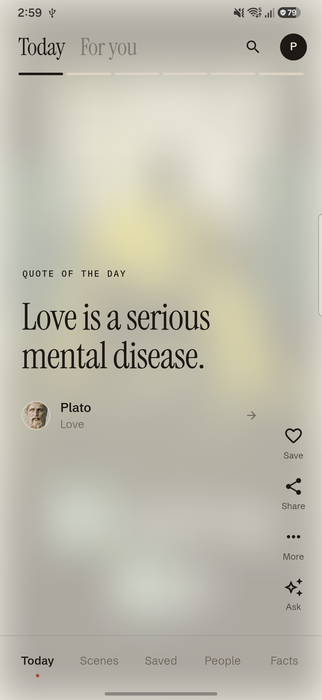
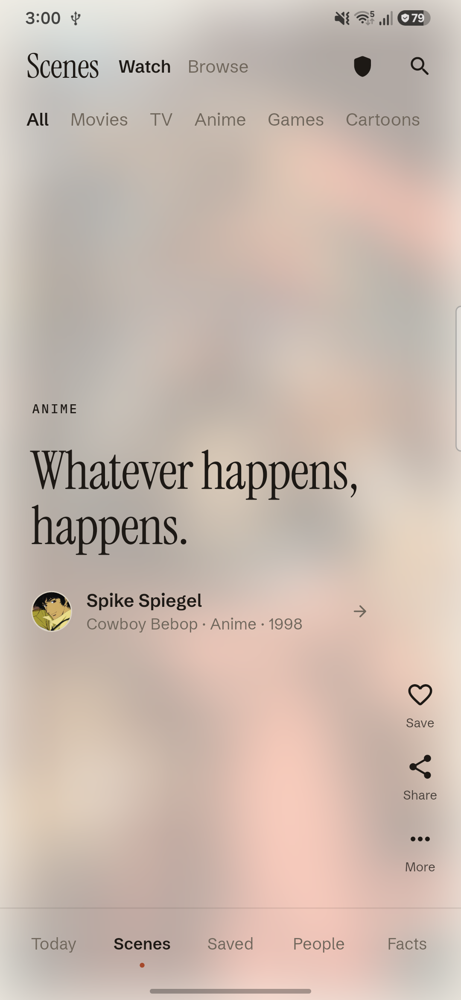
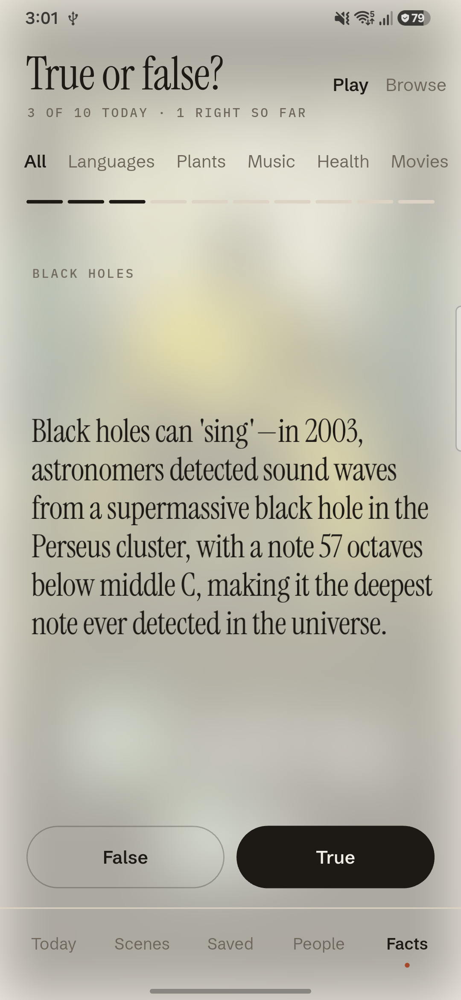
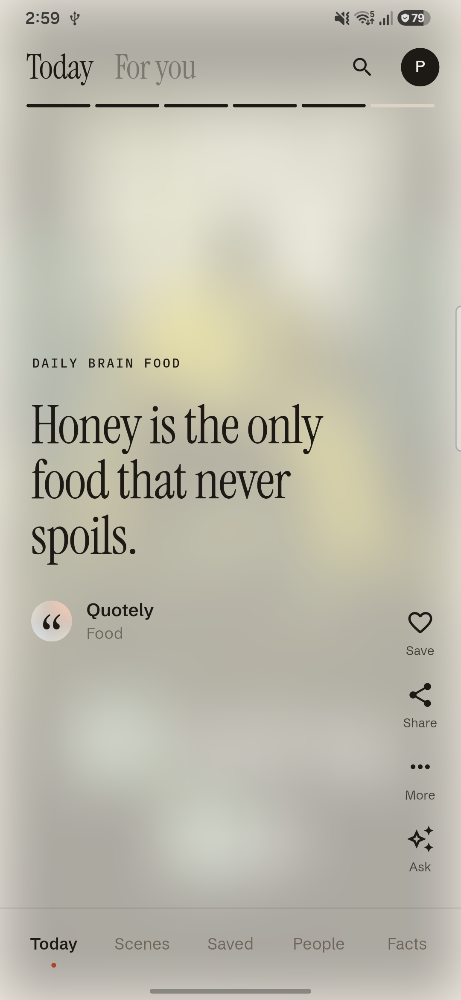
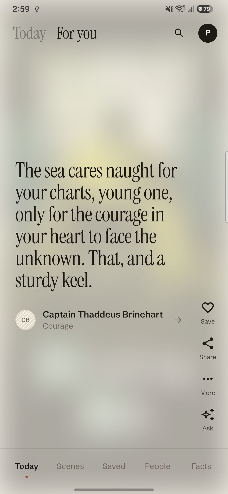
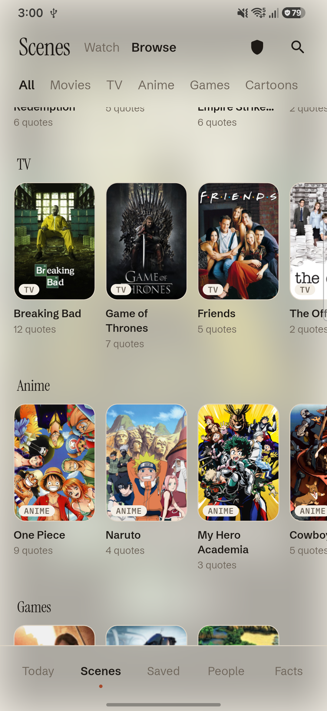
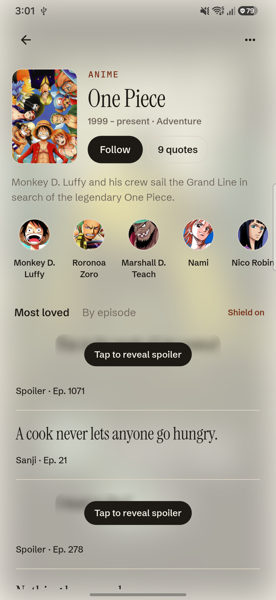
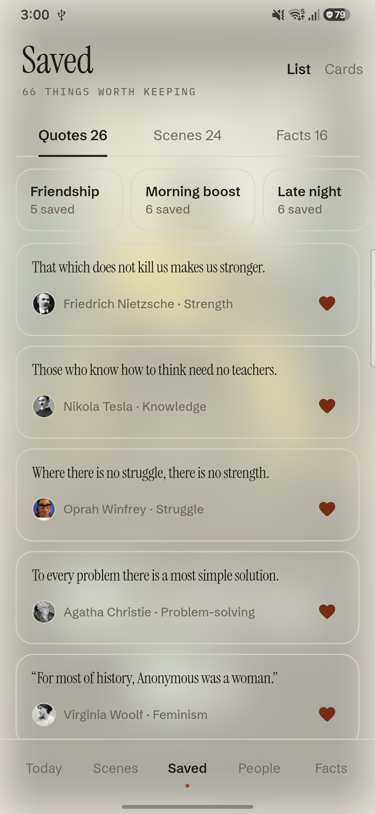
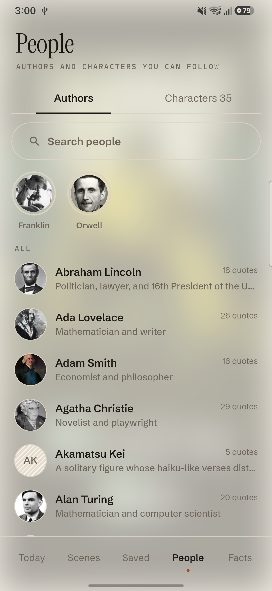
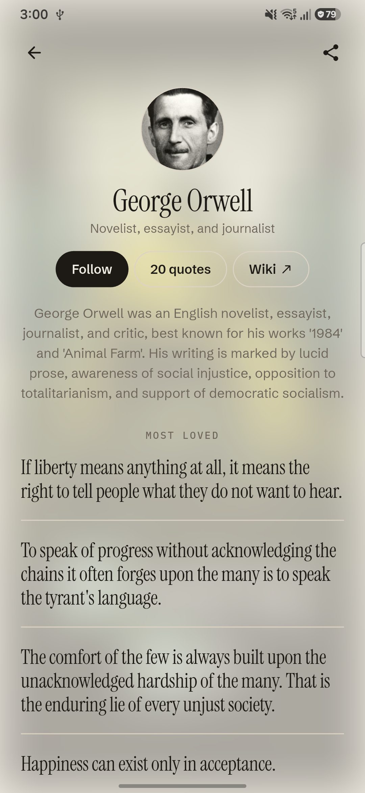

# Quotely

Wisdom, one line at a time. Quotely brings you quotes from thinkers, and lines
from films, TV shows, anime and games, one at a time, full screen, on a page
washed in the colour of that day's poster.

[](https://github.com/theprantadutta/quotely_flutter_app/releases/latest/download/quotely.apk)

<p align="center">
  
  
  
</p>

## What's new in 3.0

A complete redesign ("Spotlight"):

- **One line at a time.** Today and Scenes are full-screen feeds you swipe
  through, with Save, Share, More and Ask on a side rail.
- **An editorial look.** Instrument Serif for the words you read, Schibsted
  Grotesk for the interface, IBM Plex Mono for small labels, on warm paper.
- **The day's poster behind every screen**, blurred and washed into the page.
  Appearance → Background switches between Poster, Glow and Plain.
- **Scenes**: lines from movies, TV, anime, games and cartoons, with posters,
  characters and a spoiler shield.
- **True or false?**: a daily game of ten facts, each with a false twin; the
  card flips to the answer.
- **Local first**: everything opens instantly from the device and refreshes
  from the server in the background; the whole library syncs once a day.
- **New icon, splash and notification icons** in the Paper style.

## Features

- **Today**: quote of the day, scene of the day, fact of the day, daily
  inspiration and brain food, Monday motivation, Weird fact Wednesday and
  Friday night lines, then an endless **For you** feed shaped by your interests.
- **Ask**: type a feeling, a topic or a kind of story ("courage", "an anime line
  about friendship") and get lines that match.
- **Scenes**: *Watch* is a full-screen feed over each title's poster; *Browse*
  has trending titles and rows by type. Title pages list the cast and every line,
  by popularity or by episode. Follow titles to get their new lines.
- **Spoiler shield**: late-series lines stay blurred until you tap, or until you
  mark how far you've watched.
- **Facts**: *Play* the True or false deck (10 a day, with a daily score) or
  *Browse* every fact by category.
- **People**: authors with photos and bios, and characters from every title.
- **Saved**: quotes, scenes and facts you keep, plus your own collections.
- **Search** across quotes, authors, titles and characters.
- **Share** any line as text or as an image.
- **Offline library**: download everything (Wi-Fi only by default) and read
  with no connection.
- **Notifications**: every daily pick on its own schedule, with quiet hours.
- **Appearance**: light, dark or system; five accents; text size; serif, sans or
  mono reading font; list or card layout; poster, glow or plain background.
- **Past messages**: every quote, scene and fact of the day, by date.

## Screenshots

<p align="center">
  
  
  
  
</p>
<p align="center">
  
  
  
  
</p>
<p align="center">
  
  
</p>

## How data flows

Quotely talks to its own backend, [quotely-dotnet-api](https://github.com/theprantadutta/quotely-dotnet-api)
(ASP.NET Core, PostgreSQL, Hangfire), which generates facts and scene lines
with AI, pulls posters and character images from TMDB, AniList and RAWG, and
schedules the daily picks.

The app is **local first**: every list reads the on-device database (Drift)
straight away and refreshes from the backend in the background, and the full
library syncs silently at most once a day. On first launch, or for a filter
with nothing stored yet, it waits for the backend.

Poster and cover art: this product uses the TMDB API but is not endorsed or
certified by TMDB. Anime data and cover art from AniList. Game data and images
from RAWG.

## Tech stack

- **Flutter** (Android and iOS), **Dart**
- **Riverpod 3** (code generation) for state, **go_router** for navigation
- **Drift** for the local database, **SharedPreferences** for settings
- **Firebase**: Messaging, Analytics, Crashlytics
- **Design system** in `lib/components/thread/` and `lib/theme/` (tokens,
  typography, skeletons); brand assets are composed by
  `tools/compose_brand_assets.py` (see `assets/brand/README.md`)

## Development

```bash
flutter pub get
dart run build_runner build        # Riverpod / Drift code generation
flutter run
```

Create a `.env` in the project root with `API_KEY`, `DEV_API_URL` and
`PROD_API_URL` (it is git-ignored).

Regenerating icons and splash after a brand change:

```bash
python tools/compose_brand_assets.py
dart run flutter_launcher_icons
dart run flutter_native_splash:create
```
