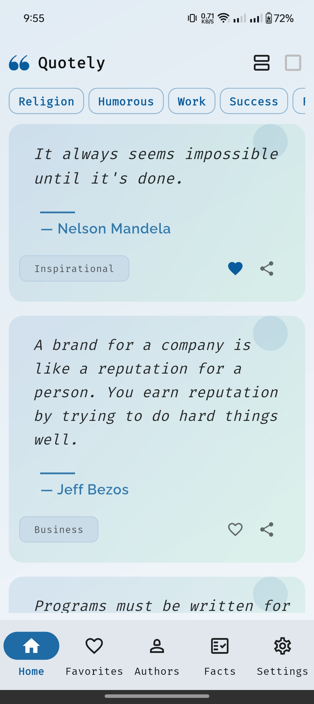
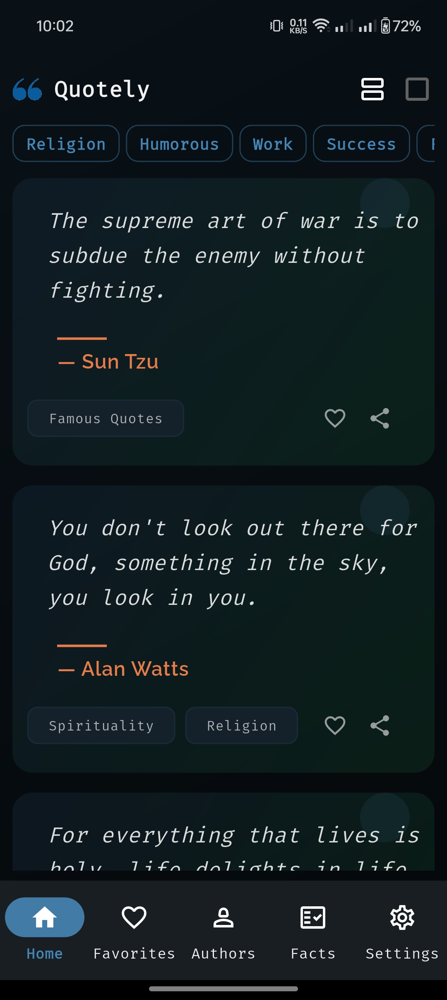
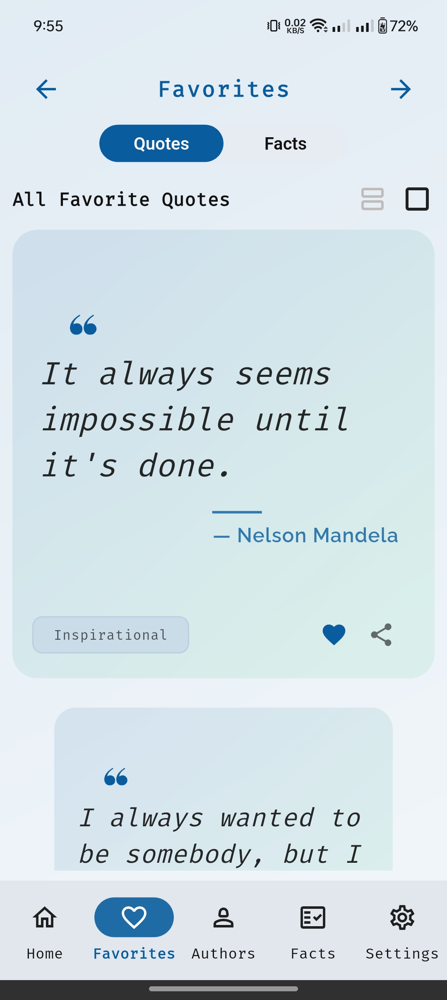
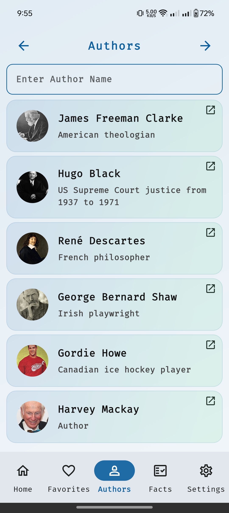
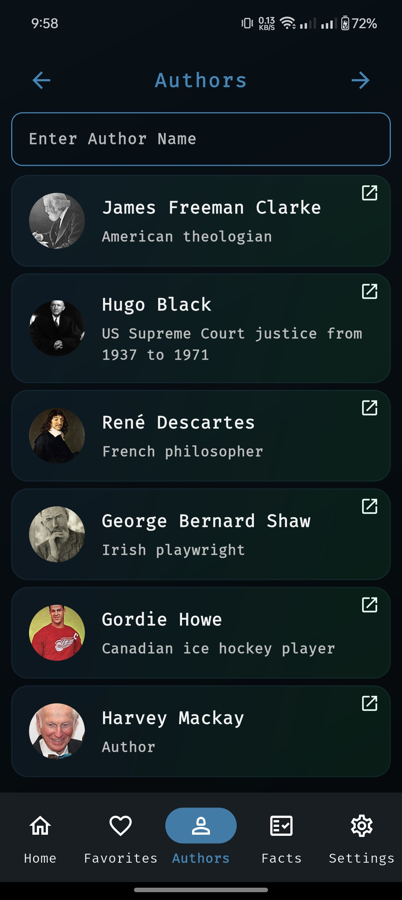
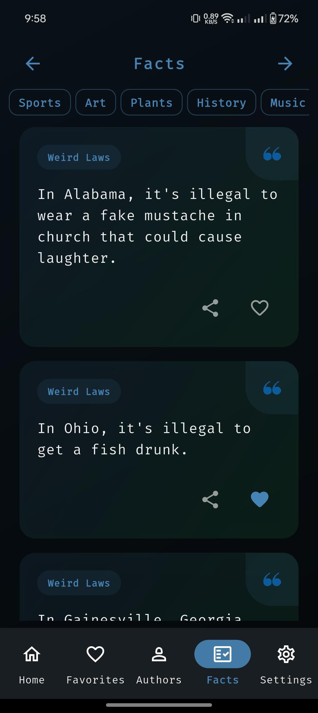
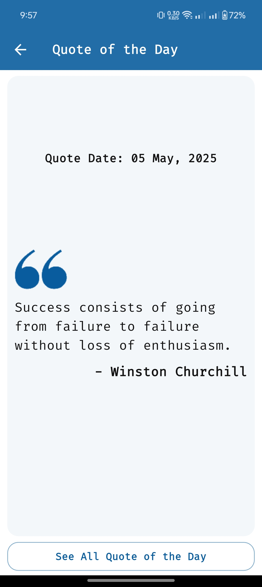

# Quotely ✨  

Quotely is a Flutter app designed for quote enthusiasts. It allows users to explore, save, and share inspirational quotes from various authors. It also has a separate section for AI generated facts. With beautiful custom UI and seamless functionality, Quotely provides a delightful experience for browsing quotes, searching for authors, and staying inspired with daily notifications.  

  
    
    

  

## Features  

- **Quote Library**: Browse a vast collection of quotes from different authors across various categories.  
- **Favorites**: Save and manage your favorite quotes for easy access.  
- **Search Authors**: Search for quotes by specific authors or topics.  
- **Share Quotes**: Share your favorite quotes with friends on social media or messaging apps.  
- **Facts**: Visit through AI generated facts of different types and categories. 
- **Notifications**:  
  - **Quote of the Day**: Receive daily inspiration with a fresh quote.  
  - **Random Quotes**: Get notified with random quotes throughout the day.  
  - **Monday Motivation**: Start your week with motivational quotes.  
  - **Daily Inspiration**: Receive notifications tailored to keep you inspired every day.  
- **Beautiful UI**: Enjoy a sleek, user-friendly interface in both light and dark themes.  

## Screenshots  

  
    
    

  

  
    
    

  

  
    
    

  

  
    
    

  

  
    
    

  

  
    
    

  

  

## 📡 API Integration  

Quotely integrates with various APIs to fetch a wide collection of quotes and author information dynamically.  

### 💬 **Quotable API**  

- **Purpose**: Provides a collection of quotes, author details, and categories.  
- **Features**:  
  - Fetch random quotes for notifications and daily inspiration.  
  - Retrieve quotes by specific authors or themes.  
  - Dynamic data updates ensure you always have fresh content.  

- **Documentation**: [Quotable API Documentation](https://github.com/lukePeavey/quotable) 

### ** ChatGPT, Mistral, Gemeni etc. **
- **Features**:
  - Provides AI generated facts.

---  

### 📊 **Tech Stack**  

- **Framework**: Flutter  

- **Languages**: Dart  

- **APIs**: Quotable APIs (Customizable)  

- **Design**: Custom widgets and UI components styled for Quotely  